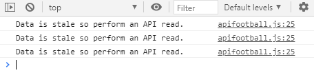
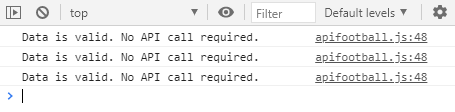
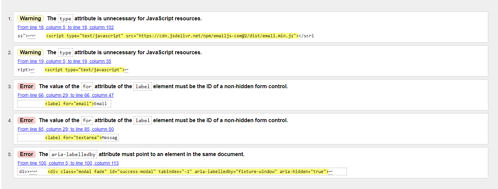

## Test Strategy

To ensure the website is fit for purpose all user stories and features documented in the main README.md file are to be tested.
The test procedures and results are documented below.

The code (HTML/CSS/JS) must also satisfy the requirements of the online validation tools. These are:

[W3C Markup Validation Service](https://validator.w3.org/). Check the markup of web documents.

[W3C CSS Validator](https://jigsaw.w3.org/css-validator/). Check Cascading Style Sheets

[JS Lint](https://jslint.com/). Javascript code quality tool. 

Google Lighthouse should be used to check the Performance, Accessibility, Best Practices and Search Engine Optimisation of the website.  

### User Story Testing
#### New Users

* *"As a user, I want to easily find my team so I can stay up to date on fixtures and results."*
    * All the current Premier League teams are listed in the league table on the home page allowing the user to select their team. Clicking any team name
	on the home page will open a dedicated page to that team that will list previous results and upcoming fixtures for that team.
* *"As a user, I want to see a list of up coming fixtures with location and kick-off times so I can plan ahead."*
    * The team page lists all upcoming fixtures with dates and kickoff times. The address of the home team is also displayed on the page below the team logo.
* *"As a user, I want to see the latest form of my team."*
    * The team page shows the form of the team covering the last five games. These are colour coded to show wins, losses and draws.
* *"As a user, I want to see live scores whenever there are any Premierships games being played so I can keep track of games when I can't watch live on TV."*
    * This feature hasn't been implemented as part of this development cycle - this was to limit the number of calls to the API. This could be added in the future
	as a premium feature as the data is available via the API.
* *"As a user, I want to see the league table for the Premiership so I can see where my team sit overall in the league."*
    * The league table is clearly displayed on both the Home and Team page. On the Team page the team currently being viewed is highlighted in the league table.
* *"As a user, I want to be able to follow the website on social media to keep up to date on any changes to the website."*
    * Social media links are listed in the footer - these are visible on all pages.

#### Returning Users
* *"As a returning user, I want the website to remember my team selection so I don't have to keep selecting my team each time I visit the site."*
    * During the development of the website it was decided not to implement this feature as the user can easily select any team quickly from the league table or fixture table.
    Also, adding this feature would not make any sense as it was decided to remove the My Team link from the navigation bar so the user would have to select
    a team anyway from the league table or fixtures table to view information on that particular table.

#### Website Owner
* *"As the owner, I want to display data in a clear and informative way that works on any platfrom."*
    * Carefull consideration was given to the layout of the site and the colour scheme. All tables are made readable on small screen devices by hiding coloums of data
    that are considered to be secondary infomration.

* *"As the owner, I want the ability to expand the website in the future to add more leagues from the UK and around the world."*
    * The API covers all the major leagues across a wide range of counties so the website can be updated to make use of this data. 
    The API call function can accept any URL so	can be used to retrieve data for any league in any country. There are no 'hard coded' league / club names 
    in the html so everything can be customised via Javascript.
* *"As the owner, I want to minimise calls to the API to keep operating costs to a minimum."*
    * A custom function has been written to retrieve the API data. Any data read by the API function will be stored locally within the browser so next the data 
    is requested no API call is required as the data can be obtained from local storage. However, if the data is stale then the API will request new data and 
    update the local storage. The expiration time of the data is determinied by a parameter passed into the function - this can be anything from a few minutes to a few days.
* *"As the owner, I want the website to be responsive in design and work across all devices from desktops to mobile phones."*
    * The website uses the Bootstrap framework that enables a responsive design that works across all devices/screen sizes. Table columns are hidden when viewed 
    on devices with small screens so the data is easily readable.

### Functional Testing

Test-001
Responsive Design - Test responsiveness of website on Chrome browser 

1. Open Chrome browser and navigate to: https://peejaywk.github.io/PremierFootball/
2. Open the developer tools by right clicking on the page and selecting 'Inspect'
3. On screen sizes >=768 pixels check that all the tables are rendered correctly and that the data is clearly visible.
4. On screen sizes <768 pixels check that all the content moves into one column (center aligned) and that the tables are re-rendered to display less information.
5. Click on any team in the league table to open the team page. Repeat the above tests in steps 3 and 4.
6. Navigate to the contact page by clicking on 'Contact' in the nav bar.
7. On screen sizes >=578 pixels check the form is displayed correctly and expands as the screen size increases.
8. On screen sizes <578 pixels check that the form items move into a single column and expand to fill the screen.

Test Result:

Test-002
Responsive Design - Test responsiveness of website on Firefox browser
1. Open Firefox browser and navigate to: https://peejaywk.github.io/PremierFootball/
2. Open the developer tools by right clicking on the page and selecting 'Inspect Element'
3. On screen sizes >=768 pixels check that all the tables are rendered correctly and that the data is clearly visible.
4. On screen sizes <768 pixels check that all the content moves into one column (center aligned) and that the tables are re-rendered to display less information.
5. Click on any team in the league table to open the team page. Repeat the above tests in steps 3 and 4.
6. Navigate to the contact page by clicking on 'Contact' in the nav bar.
7. On screen sizes >=578 pixels check the form is displayed correctly and expands as the screen size increases.
8. On screen sizes <578 pixels check that the form items move into a single column and expand to fill the screen.

Test Result:

Test-003
Responsive Design - Test responsiveness of website on Opera browser
1. Open Opera browser and navigate to: https://peejaywk.github.io/PremierFootball/
2. Open the developer tools by right clicking on the page and selecting 'Inspect element'
3. On screen sizes >=768 pixels check that all the tables are rendered correctly and that the data is clearly visible.
4. On screen sizes <768 pixels check that all the content moves into one column (center aligned) and that the tables are re-rendered to display less information.
5. Click on any team in the league table to open the team page. Repeat the above tests in steps 3 and 4.
6. Navigate to the contact page by clicking on 'Contact' in the nav bar.
7. On screen sizes >=578 pixels check the form is displayed correctly and expands as the screen size increases.
8. On screen sizes <578 pixels check that the form items move into a single column and expand to fill the screen.

Test Result:

Test-004
Responsive Design - Test responsiveness of website on Microsoft Edge browser
1. Open Edge browser and navigate to: https://peejaywk.github.io/PremierFootball/
2. Open the developer tools by right clicking on the page and selecting 'Inspect'
3. On screen sizes >=768 pixels check that all the tables are rendered correctly and that the data is clearly visible.
4. On screen sizes <768 pixels check that all the content moves into one column (center aligned) and that the tables are re-rendered to display less information.
5. Click on any team in the league table to open the team page. Repeat the above tests in steps 3 and 4.
6. Navigate to the contact page by clicking on 'Contact' in the nav bar.
7. On screen sizes >=578 pixels check the form is displayed correctly and expands as the screen size increases.
8. On screen sizes <578 pixels check that the form items move into a single column and expand to fill the screen.

Test Result:

Test-005
Navigation Links - Test all links are working in the nav bar
1. Open Chrome browser and navigate to https://peejaywk.github.io/PremierFootball/
2. Click on the 'Contact' link in the nav bar and check that the contact page is displayed.
3. Click on the 'Home' link in the nav bar and check you are returned to the Home page.
4. Click on any team in the league or fixture table and check that the correct team page is opened.
5. Click on the Home icon on the top left and corner of the page and check you are returned to the Home page.
6. Repeat tests using Firefox, Opera and Edge browsers.
7. Repeat tests on mobile device if possible.

Test Result:

Test-006
Footer Links - Test all links are working in the footer.
1. Open Chrome browser and navigate to https://peejaywk.github.io/PremierFootball/
2. Click on each social media link and verify it opens up the correct page in a new browser tab.
3. Click on the email link and verify that it opens the email client. The response may vary depending on the computer setup.
4. Repeat tests using Firefox, Opera and Edge browsers.
5. Repeat tests on mobile device if possible.

Test Result:

Test-007
Statistics Button - Test that clicking on the 'stats' button opens a modal window on the device.
1. Open Chrome browser and navigate to https://peejaywk.github.io/PremierFootball/
2. Click on any team in the league or fixture table to open Team page.
3. Click on the green 'stats' button and check that the modal window opens.
4. Check that the team names at the top of the modal match those associated with the 'stats' button in the results table.
5. Check that the modal can be closed by either clicking on the 'x' or clicking anywhere outside the modal window.
6. Repeat tests using Firefox, Opera and Edge browsers.
7. Repeat tests on mobile device if possible.

Test Result:

Test-008
Contact Form - Test the contact form validation works and the emailJS service has been setup correctly.
1. Open Chrome browser and navigate to https://peejaywk.github.io/PremierFootball/contact.html
2. Click on the 'Send' button and check that the form asks you to fill in the name field.
3. Fill in the name field and click on the 'send' button. Check that the form asks you to fill in the email address field.
4. Fill in the email field with a valid email address and click on the 'send' button. Check that the form asks you to fill in the subject field. The contact number field is opptional so the form won't prompt you to fill in this field.
5. Fill in the subject field and click on the 'send' button. Check that the form asks you to fill in the message field.
6. Fill in the message field and click on the 'send' button. Check that the 'Message Sent Successfully!' modal window is displayed.
7. Check that the confirmation email has been received at the address given in step 4.
8. Check that the user message as been received at the website email account (premierfootball.ci@gmail.com).
9. Repeat tests using Firefox, Opera and Edge browsers.
10. Repeat tests on mobile device if possible.

Test Result:

Test-009
Team Links - Test all the team links work from the Home and Team page.
1. Open Chrome browser and navigate to https://peejaywk.github.io/PremierFootball/
2. Click on any team in the league or fixture table to open Team page.
3. Check that the team being displayed corresponds to the link clicked on the Home page.
4. Check that the correct team is highlighted in the Premier League table.
5. Click on another team on the Team page and check that the page updates to show information for that team.
6. Repeat tests using Firefox, Opera and Edge browsers.
7. Repeat tests on mobile device if possible.

Test Result:

Test-010
API Data Retrieval - Check that the website only requests data if it is stale or has not been requested before.
1. Open a new Incognito window in the Chrome browser.
2. Open the developer tools by right clicking on the page and selecting 'Inspect'
3. In the developer tools click on the Console in the top menu bar.
4. Open page https://peejaywk.github.io/PremierFootball/ in the igcognito window.
5. In the console window check that the website has made 3 calls to request data from the API as the data is stale and has never been read. The correct console log is shown below:
	
    
6. Reload the page by pressing F5 or by clicking on the reload icon.
7. In the console log check that the website has not performed any API reads as the data has already been read and stored locally. The correct console log is shown below:

    

Test Result:

### HTML Validation
To validate the HTML the online [W3C Markup Validation Service](https://validator.w3.org/) was used. Each of the three pages was tested using this online tool.

* Home Page ([W3C Validation Report](Html-Checker-HomePage.pdf))
No errors or warnings found.

* Team Page ([W3C Validation Report](Html-Checker-TeamPage.pdf))
No errors or warnings found.

* Contact Page ([W3C Validation Report](Html-Checker-ContactPage.pdf))
The following errors and warnings were found:

Corrected the errors and warnings and repeated the test. No errors and warnings found.

### CSS Validation
To validate the CSS the online [W3C CSS Validator](https://jigsaw.w3.org/css-validator/) was used. 
No errors or warnings found. [CSS Validation Report](W3C-CSS-Validator-Results.pdf)

### Lighthouse Report
Google Lighthouse was used to check the Performance, Accessibility, Best Practices and Search Engine Optimisation of the website.
The reports for the three pages are linked below.
* [Lighthouse Report - Home Page](/assets/documents/testing/LightHouseReport-Index.pdf)
* [Lighthouse Report - Team Page](/assets/documents/testing/LightHouseReport-About.pdf)
* [Lighthouse Report - Contact Page](/assets/documents/testing/LightHouseReport-Contact.pdf)
